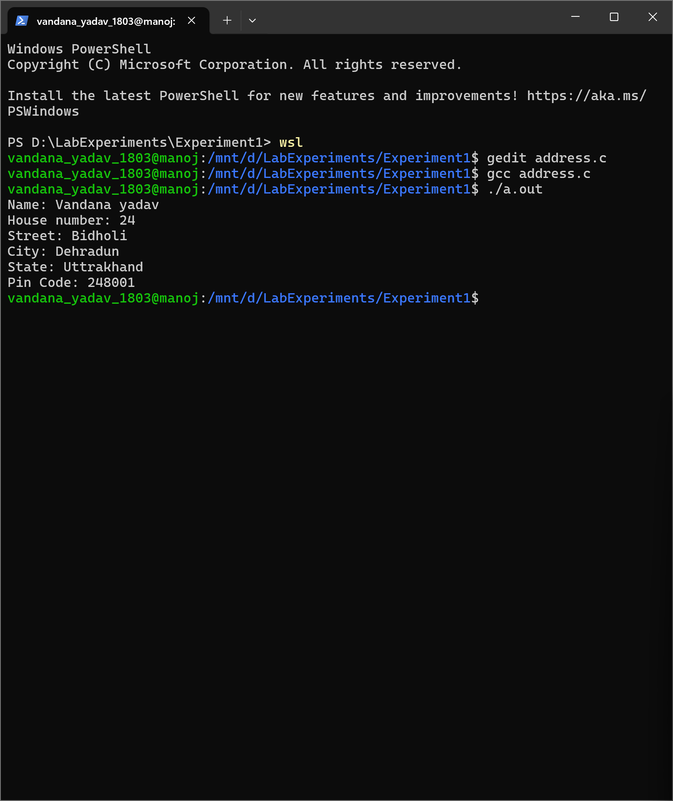
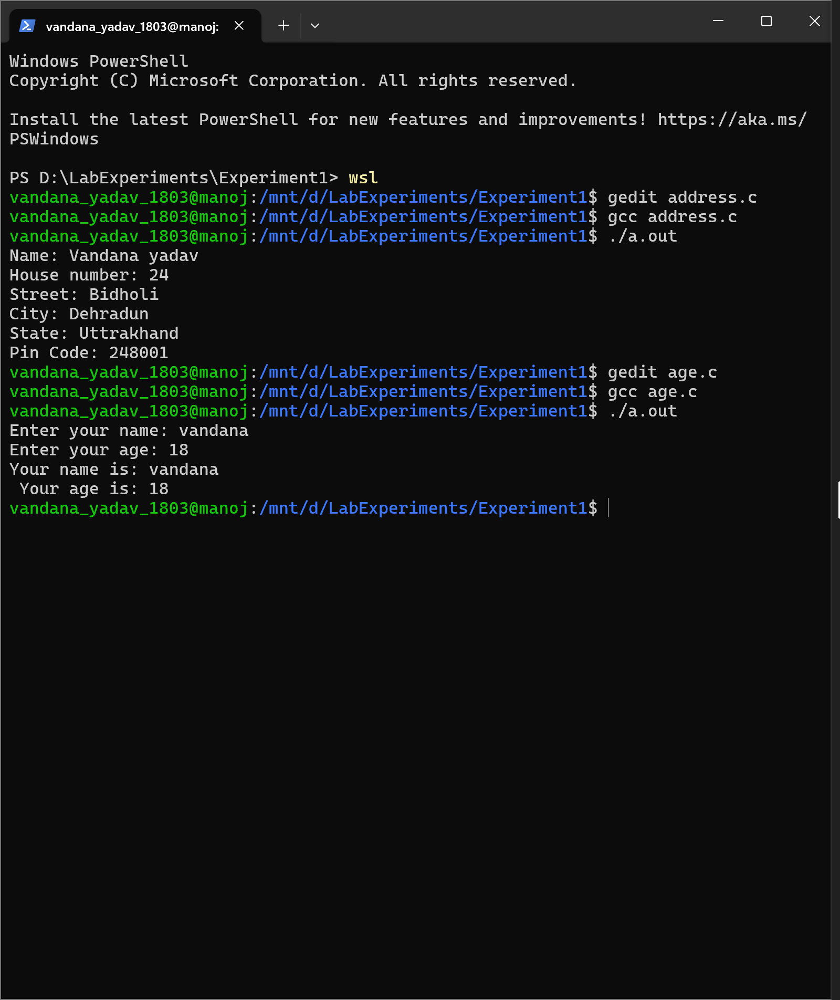
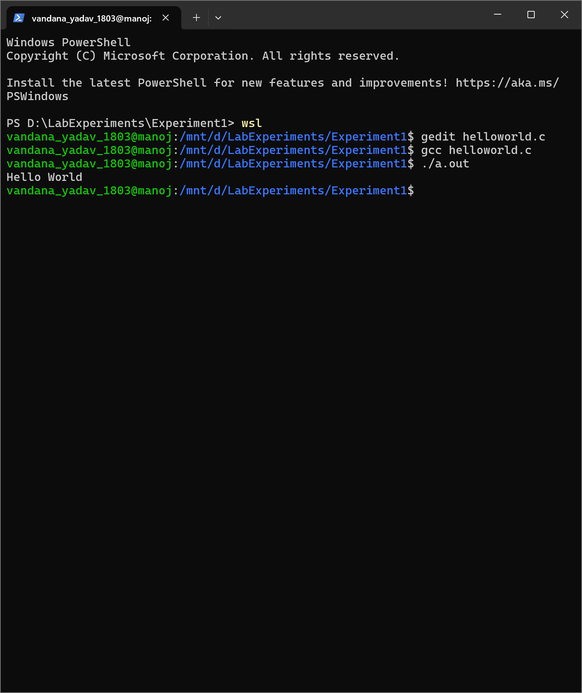
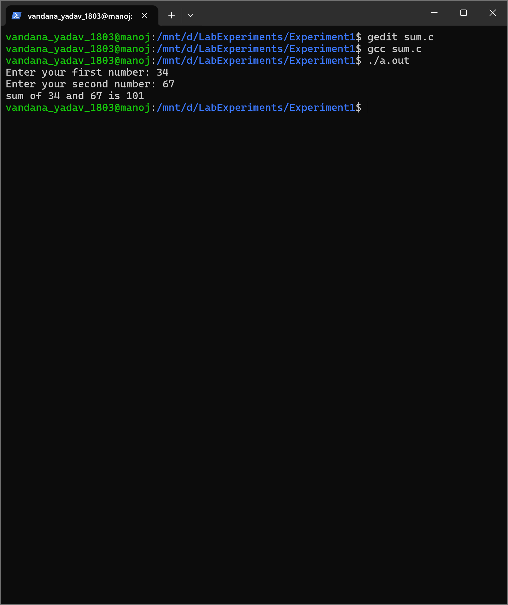
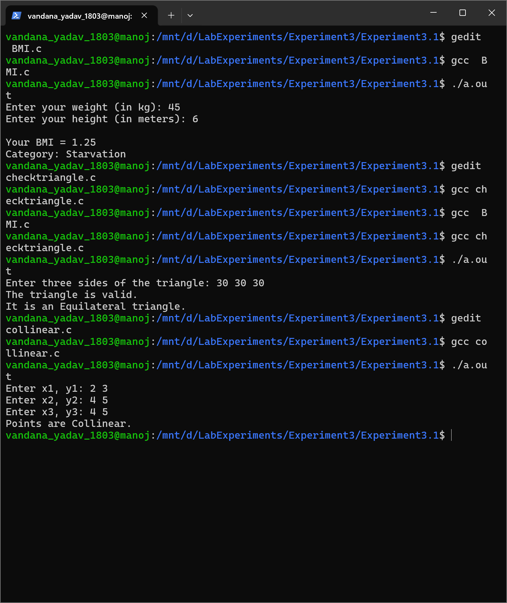
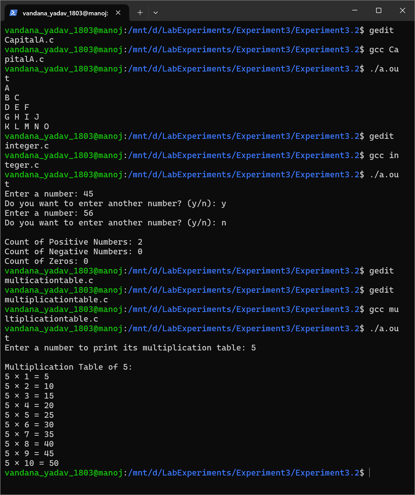
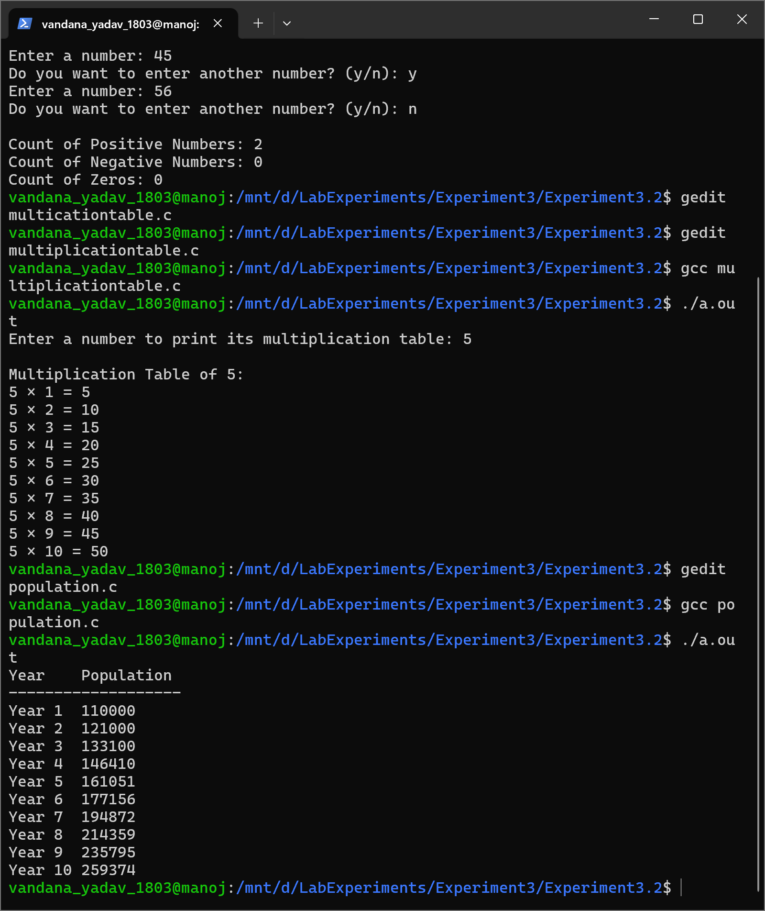
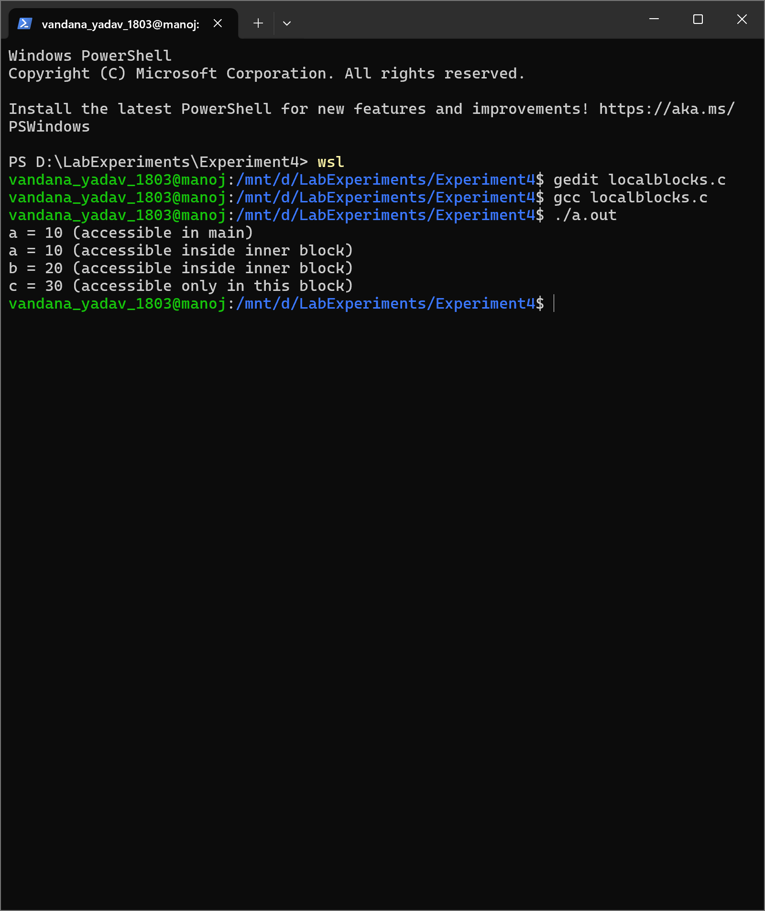
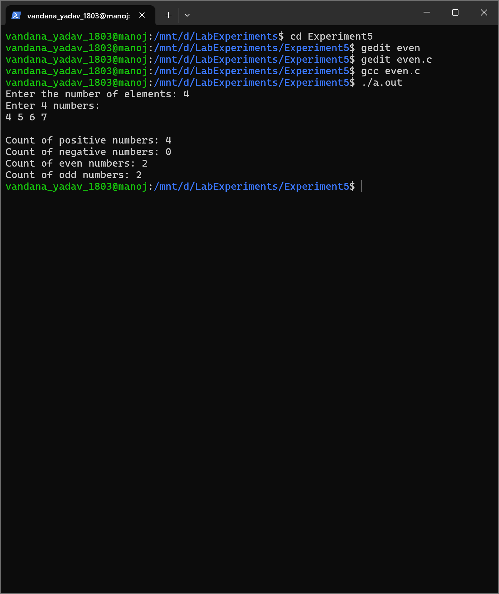
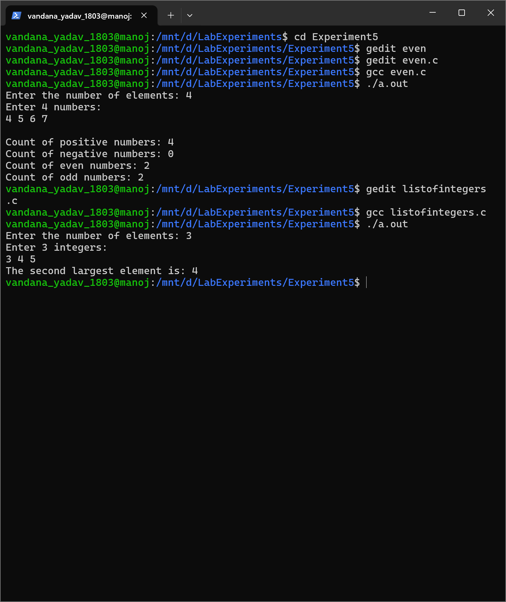

# 💻 C Programming Lab Experiments  

Welcome to my **C Programming Lab Repository** — a well-organized collection of all lab experiments completed during my coursework.  
Each experiment folder includes both the **C source code** and its **output screenshot**, demonstrating the actual results.

---
# 💻 C Programming Lab Experiments  

Welcome to my **C Programming Lab Repository** — a well-organized collection of all lab experiments completed during my coursework.  
Each experiment folder includes both the **C source code** and its **output screenshot**, demonstrating the actual results.

---

## 📘 Experiment 1 — *Introduction to C Programming*  
**Basic Input/Output and Arithmetic Programs**

| Program | Screenshot |
|----------|-------------|
| [address.c](Experiment1/address.c) |  |
| [age.c](Experiment1/age.c) |  |
| [helloworld.c](Experiment1/helloworld.c) |  |
| [sum.c](Experiment1/sum.c) |  |

---

## ⚙️ Experiment 2 — *Calculations and Conversions*  
**Programs involving area, perimeter, and temperature conversions**

| Program | Screenshot |
|----------|-------------|
| [areaandperimenter.c](Experiment2/areaandperimenter.c) |  |
| [celsiustofahrenheit.c](Experiment2/celsiustofahrenheit.c) |  |

---

## 🧮 Experiment 3.1 — *Conditional Logic and Problem Solving*  
**Programs implementing conditions, logic, and decision making**

| Program | Screenshot |
|----------|-------------|
| [bmi.c](Experiment3/Experiment3_1/bmi.c) |  |
| [collinear.c](Experiment3/Experiment3_1/collinear.c) |  |
| [Gregoriancalender.c](Experiment3/Experiment3_1/Gregoriancalender.c) |  |
| [ternaryoperator.c](Experiment3/Experiment3_1/ternaryoperator.c) |  |
| [triangles.c](Experiment3/Experiment3_1/triangles.c) |  |

---

## 🔁 Experiment 3.2 — *Loops and Iterative Logic*  
**Programs demonstrating loop structures and iteration concepts**

| Program | Screenshot |
|----------|-------------|
| [multiplicationtable.c](Experiment3/Experiment3_2/multiplicationtable.c) |  |
| [pattern.c](Experiment3/Experiment3_2/pattern.c) |  |
| [pattern2.c](Experiment3/Experiment3_2/pattern2.c) |  |
| [population.c](Experiment3/Experiment3_2/population.c) |  |
| [ramanujan.c](Experiment3/Experiment3_2/ramanujan.c) |  |
| [signinteger.c](Experiment3/Experiment3_2/signinteger.c) |  |

---

## 🧠 Experiment 4 — *Variable Scope and Lifetime*  
**Programs showing use of local and global variables**

| Program | Screenshot |
|----------|-------------|
| [declarevariables.c](Experiment4/declarevariables.c) |  |
| [localblocks.c](Experiment4/localblocks.c) |  |
| [localvariable.c](Experiment4/localvariable.c) |  |

---

## 🔢 Experiment 5 — *Conditionals and Iterations*  
**Programs combining conditional statements with iterative logic**

| Program | Screenshot |
|----------|-------------|
| [even.c](Experiment5/even.c) |  |
| [listofintegers.c](Experiment5/listofintegers.c) |  |
| [listofparticularnumber.c](Experiment5/listofparticularnumber.c) |  |
| [matrices.c](Experiment5/matrices.c) |  |

---

## 👨‍💻 Author  
**Aman Barnwal**  
🎓 Student at UPES  
📬 [GitHub Profile](https://github.com/aman-barnwal)

---

## ⚡ How to Run  

1. Clone this repository  
   ```bash
   git clone https://github.com/aman-barnwal/Cexperiments.git

## 📘 Experiment 1 — *Introduction to C Programming*  
**Basic Input/Output and Arithmetic Programs**

| Program | Screenshot |
|----------|-------------|
| [address.c](Experiment1/address.c) |  |
| [age.c](Experiment1/age.c) |  |
| [helloworld.c](Experiment1/helloworld.c) |  |
| [sum.c](Experiment1/sum.c) |  |

---

## ⚙️ Experiment 2 — *Calculations and Conversions*  
**Programs involving area, perimeter, and temperature conversions**

| Program | Screenshot |
|----------|-------------|
| [areaandperimenter.c](Experiment2/areaandperimenter.c) |  |
| [celsiustofahrenheit.c](Experiment2/celsiustofahrenheit.c) |  |

---

## 🧮 Experiment 3.1 — *Conditional Logic and Problem Solving*  
**Programs implementing conditions, logic, and decision making**

| Program | Screenshot |
|----------|-------------|
| [bmi.c](Experiment3/Experiment3.1/bmi.c) |  |
| [collinear.c](Experiment3/Experiment3.1/collinear.c) |  |
| [Gregoriancalender.c](Experiment3/Experiment3.1/Gregoriancalender.c) |  |
| [ternaryoperator.c](Experiment3/Experiment3.1/ternaryoperator.c) |  |
| [triangles.c](Experiment3/Experiment3.1/triangles.c) |  |

---

## 🔁 Experiment 3.2 — *Loops and Iterative Logic*  
**Programs demonstrating loop structures and iteration concepts**

| Program | Screenshot |
|----------|-------------|
| [multiplicationtable.c](Experiment3/Experiment3.2/multiplicationtable.c) |  |
| [pattern.c](Experiment3/Experiment3.2/pattern.c) |  |
| [pattern2.c](Experiment3/Experiment3.2/pattern2.c) |  |
| [population.c](Experiment3/Experiment3.2/population.c) |  |
| [ramanujan.c](Experiment3/Experiment3.2/ramanujan.c) |  |
| [signinteger.c](Experiment3/Experiment3.2/signinteger.c) |  |

---

## 🧠 Experiment 4 — *Variable Scope and Lifetime*  
**Programs showing use of local and global variables**

| Program | Screenshot |
|----------|-------------|
| [declarevariables.c](Experiment4/declarevariables.c) |  |
| [localblocks.c](Experiment4/localblocks.c) |  |
| [localvariable.c](Experiment4/localvariable.c) |  |

---

## 🔢 Experiment 5 — *Conditionals and Iterations*  
**Programs combining conditional statements with iterative logic**

| Program | Screenshot |
|----------|-------------|
| [even.c](Experiment5/even.c) |  |
| [listofintegers.c](Experiment5/listofintegers.c) |  |
| [listofparticularnumber.c](Experiment5/listofparticularnumber.c) |  |
| [matrices.c](Experiment5/matrices.c) |  |

---

## 👨‍💻 Author  
**Aman Barnwal**  
🎓 Student at UPES  
📬 [GitHub Profile](https://github.com/aman-barnwal)

---

## ⚡ How to Run  

1. Clone this repository  
   ```bash
   git clone https://github.com/aman-barnwal/Cexperiments.git

